# SQL Job Actions

For more information on SQL Agent job fields, refer to [SQL Job Details](https://help.smatechnologies.com/opcon/core/rolling/Files/Concepts/SQL%20Job%20Details.htm) in the **Concepts** online help.

## MS SQL DTExec

For more information on the MS SQL DTExec job type, refer to [Fields for MS SQL DTExec](https://help.smatechnologies.com/opcon/core/rolling/Files/Concepts/SQL-Job-Details.md#Fields_for_MS_SQL_DTExec) in the **Concepts** online help.

The following is an example of how to define a MS SQL DTExec job with FILE as the Connection type:


The following is an example of how to define a MS SQL DTExec job with SQL as the Connection type:

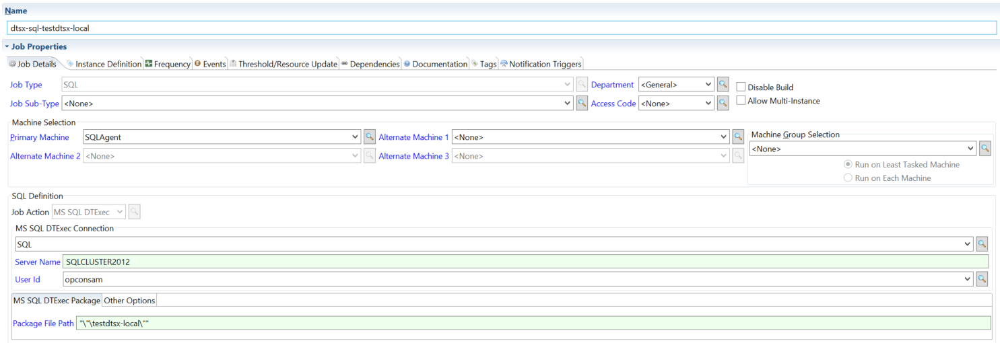

## MS SQL Job

For more information on the MS SQL Job type, refer to [Fields for MS SQL Job](https://help.smatechnologies.com/opcon/core/rolling/Files/Concepts/SQL-Job-Details.md#Fields_for_MS_SQL_Job) in the **Concepts** online help.

The following is an example of how to start a MS SQL Server Agent job and monitor it until completion:

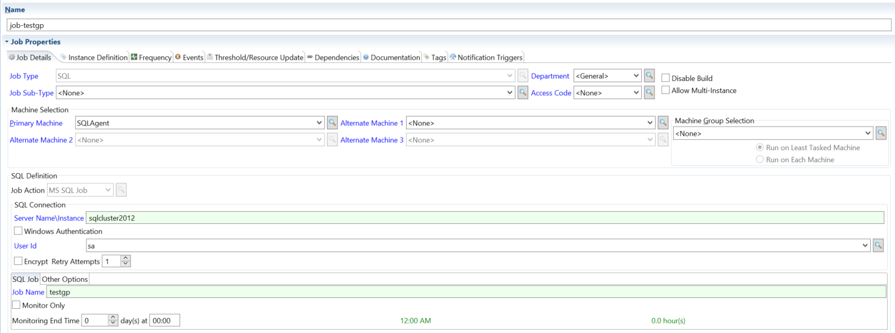

The following is an example of a MS SQL Server Agent job to monitor only when the MS SQL Server Agent job is running:

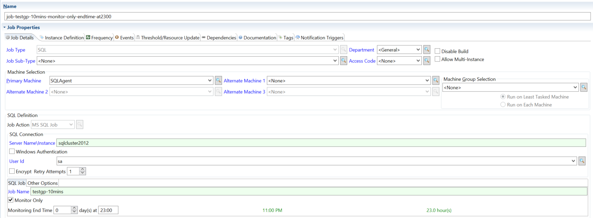

The following is an example of how to start a MS SQL Server Agent job and monitor it until the specified run time:

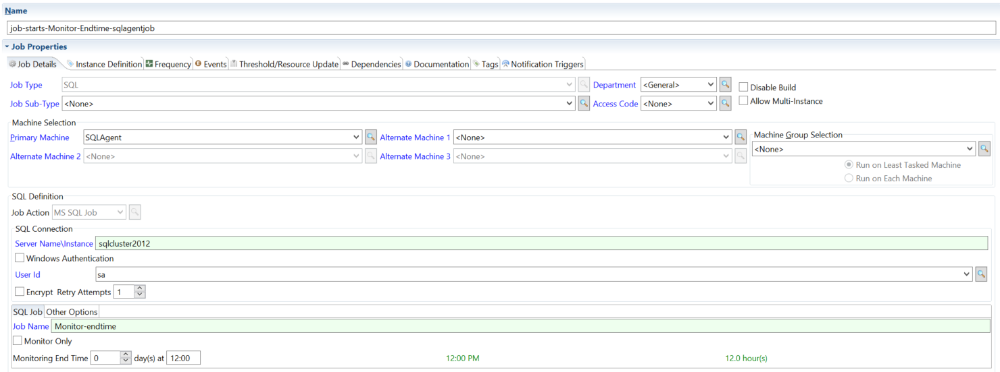

The following is an example of how to start and monitor a MS SQL Server Agent job with a password overwrite option:

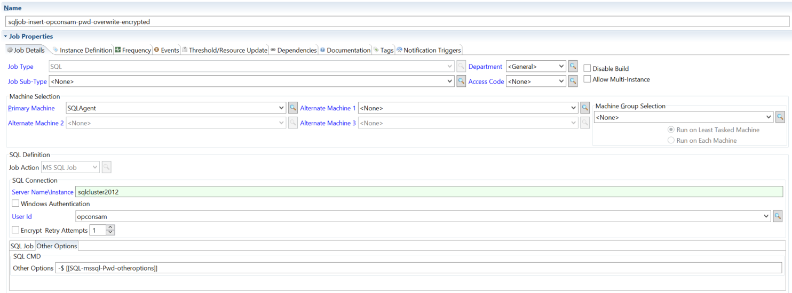

## MS SQL Script

For more information on the MS SQL Script job type, refer to [Fields for MS SQL Script](https://help.smatechnologies.com/opcon/core/rolling/Files/Concepts/SQL-Job-Details.md#Fields_for_MS_SQL_Script) in the **Concepts** online help.

The following is an example of how to define a MS SQL Script job with In Line Script job details:

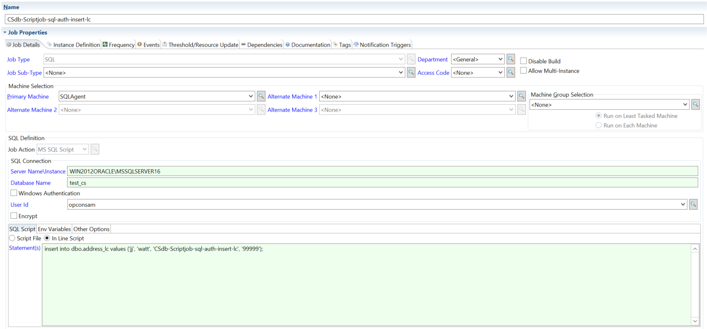

The following is an example of how to define a MS SQL Script job with In Line Script and Environment Variables:

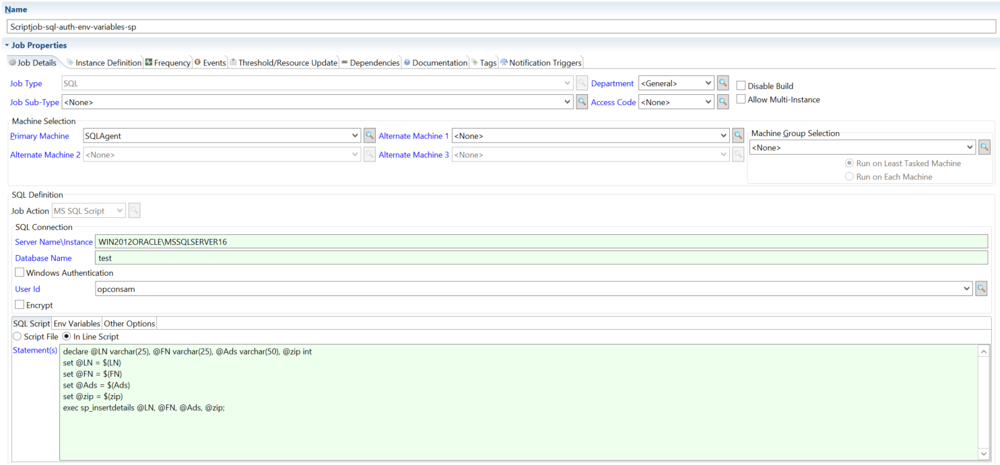

The following is an example of how to define a MS SQL Script job with In Line Script with Environment Variables:

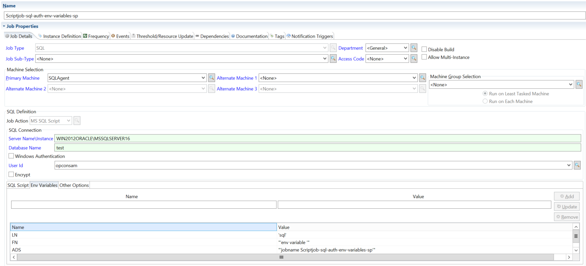

The following is an example of how to define a MS SQL Script job with a job output file and a password overwrite option:


The following is an example of how to define a MS SQL Script job with Windows Authentication and Script File:

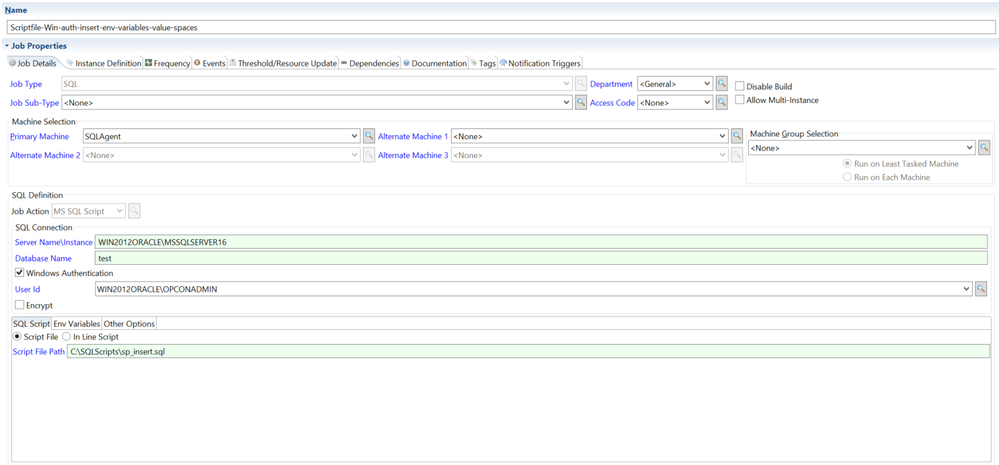

## MySQL

For more information on the MySQL job type, refer to [Fields for MySQL](https://help.smatechnologies.com/opcon/core/rolling/Files/Concepts/SQL-Job-Details.md#Fields_for_MySQL) in the **Concepts** online help.

The following is an example of a MySQL job with a default port:

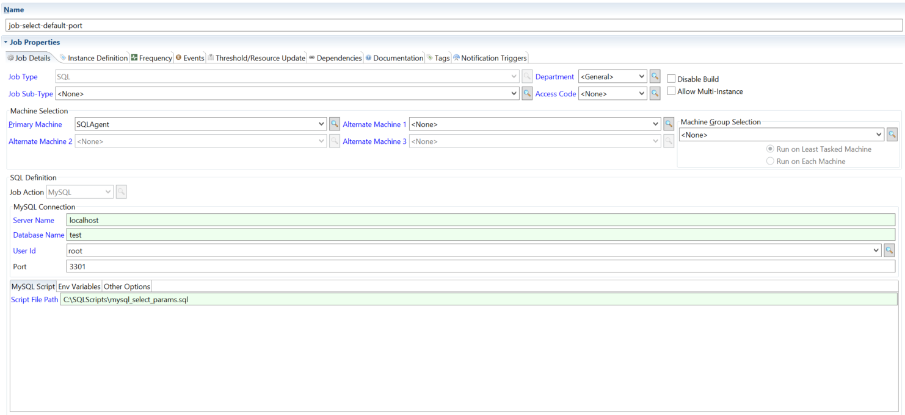

The following is an example of a MySQL job with a password overwrite option:

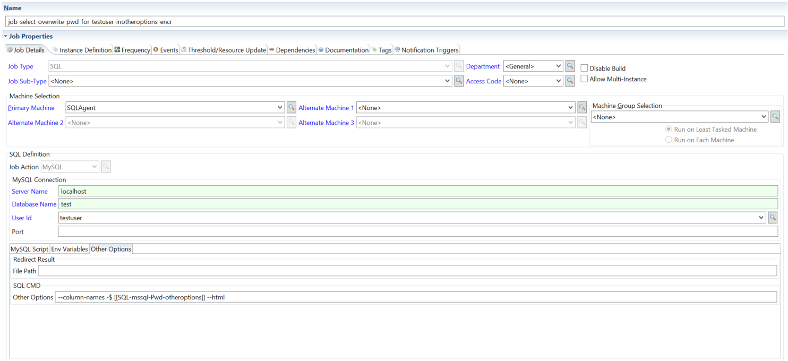

The following is an example of a MySQL job details to use for Environment Variables:

Script File Path: C:\\SQLScripts\\mysql_insert_params.sql

"Mysql_insert_params.sql" script details:

```sql
Insert into address (Lastname, Firstname, Address) values (@LN, @FN, @ADS);
```

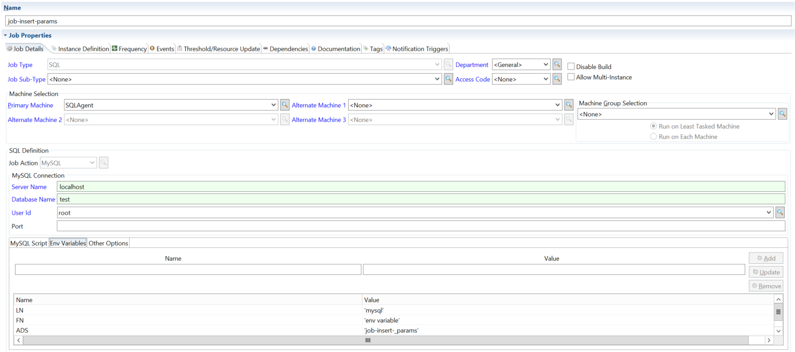

## Oracle

For more information on the [Oracle]{.GeneralAgentName(JobType5)} job type, refer to [Fields for Oracle](https://help.smatechnologies.com/opcon/core/rolling/Files/Concepts/SQL-Job-Details.md#Fields_for_Oracle) in the **Concepts** online help.

The following is an example of an [Oracle]{.GeneralAgentName(JobType5)} job with an output file path and a password overwrite option:


The following is an example of an [Oracle]{.GeneralAgentName(JobType5)} job with parameters:

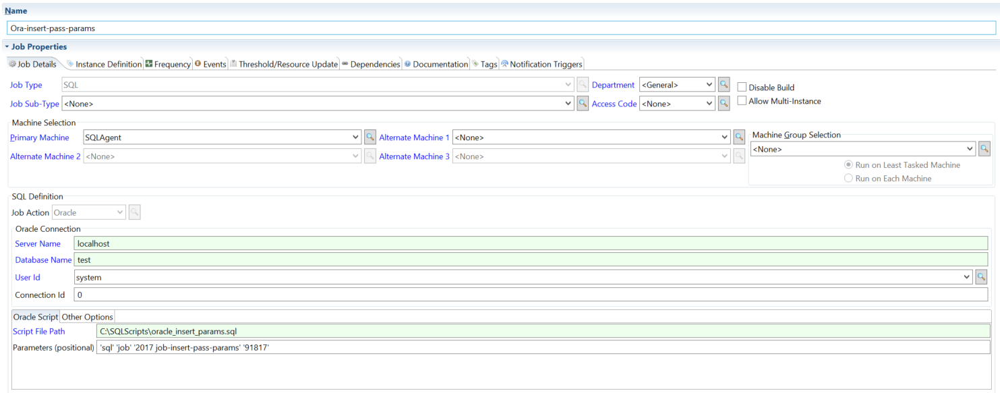

The following is an example of an [Oracle]{.GeneralAgentName(JobType5)} job with encrypted parameters:


The following is an example of an [Oracle]{.GeneralAgentName(JobType5)} job with a Connection ID:

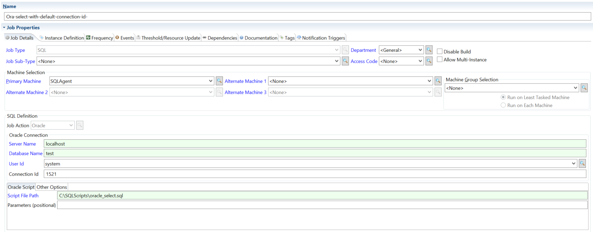

## Other DB

For more information on the [Other DB]{.GeneralAgentName(JobType6)} job type, refer to [Fields for Other DB](https://help.smatechnologies.com/opcon/core/rolling/Files/Concepts/SQL-Job-Details.md#Fields_for_Other_DB) in the **Concepts** online help.

The following two examples are of an Other DB job with DSN Name and In Line Script with Environment Variables:


Defining Other DB using DSN Name with In Line Script and Environment Variables 2

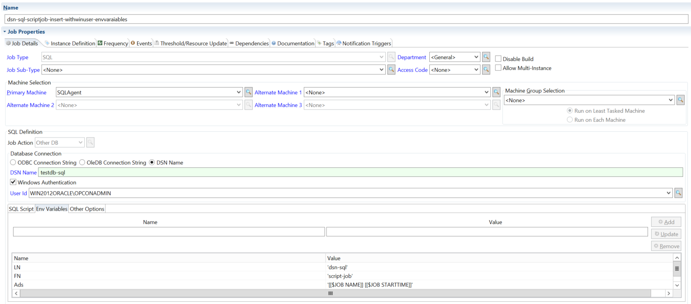

The following is an example of an Other DB job with DSN Name with a password overwrite option:

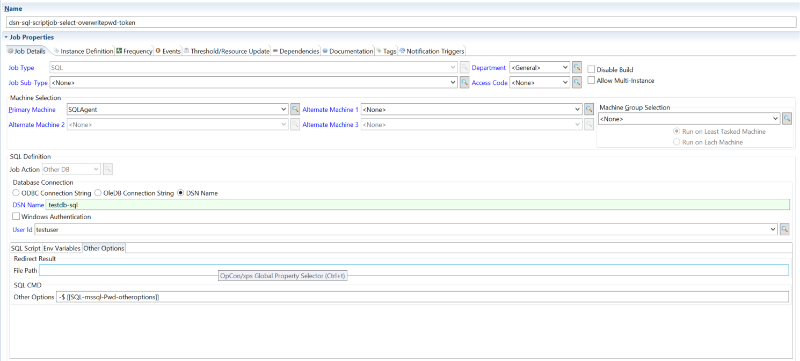

The following is an example of an Other DB job with an OleDB Connection String:

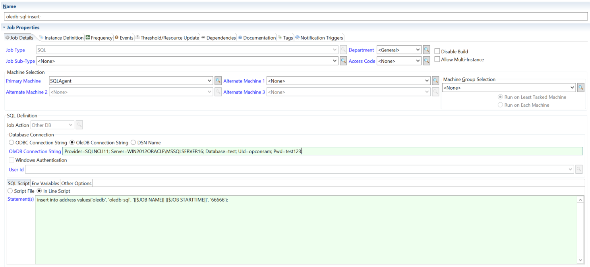

The following two examples are of an Other DB job with an OleDB Connection String with Script File and Environment Variables:

Insert-with-params.sql script file details:

```sql
declare @LN varchar(25), @FN varchar(25), @Ads varchar(50), @zip int;

set @LN = $(LN);

set @FN = $(FN);

set @Ads = $(Ads);

set @zip = $(zip);

select * from address where Lastname = @LN;

insert into address values(@LN,@FN,@Ads,@zip);
```

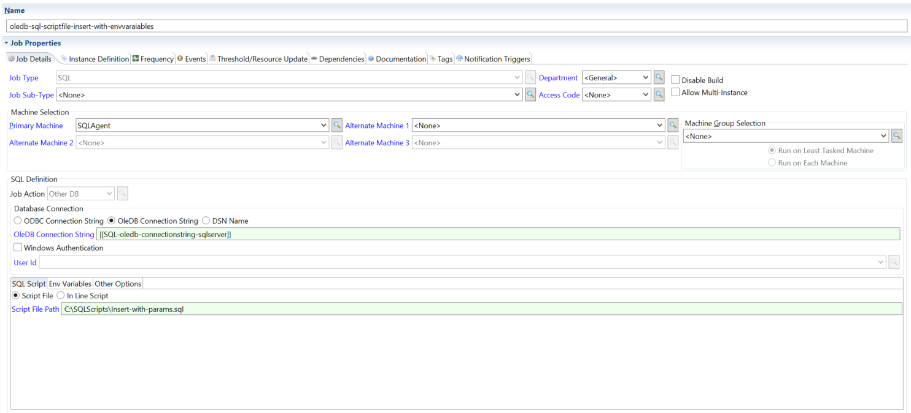

Defining Other DB using OleDB Connection String with Environment Variables


The following is an example of an Other DB job with an ODBC Connection String with In Line Script:

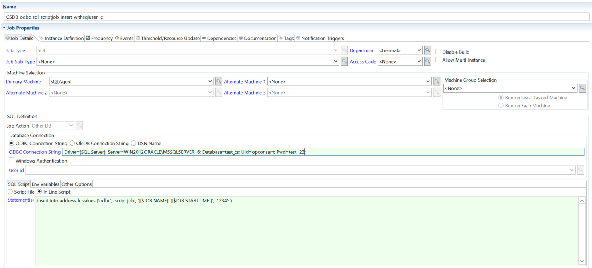

The following is an example of an Other DB job with an ODBC Connection String with In Line Script with Environment Variables:

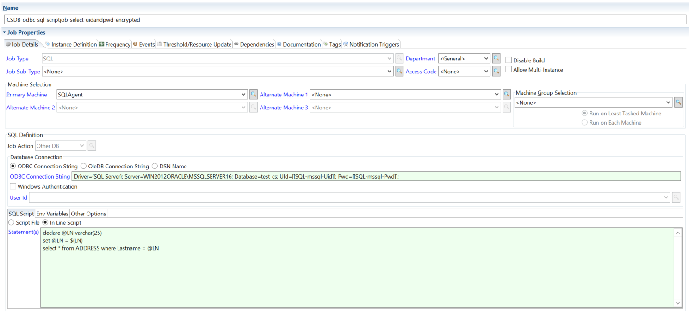
